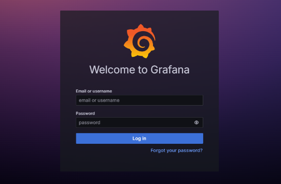

# FINAL-PROJECT-OS-SERVER-SYSTEM-ADMIN---23.83.0961

Pada Repository tersebut berisi dokumentasi pengerjaan saya pada saat memberikan layanan server terhadap WEB yang sebelumnya saya buat.

## Daftar Isi
- [Layanan Server Nginx](#Layanan-Nginx)
- [Layanan Server Apache2](#instalasi)
- [Penggunaan](#penggunaan)
- [Kontribusi](#kontribusi)
- [Lisensi](#lisensi)


# 1. Layanan Nginx
Nginx adalah perangkat lunak web server open-source yang berfungsi sebagai reverse proxy, load balancer, dan HTTP cache. Nginx memiliki beberapa kelebihan, di antaranya: 
- Dapat menangani banyak koneksi secara bersamaan 
- Efisien dalam penggunaan sumber daya 
- Dukungan OS yang luas, termasuk Linux, Unix, dan Windows 
- Pemeliharaan konfigurasi real-time 

### Konfigurasi

### Langkah 1: Update Sistem
Pertama-tama, pastikan sistem Anda sudah diperbarui dengan perintah berikut:

```bash
sudo apt update
sudo apt upgrade

```

### Langkah 2: Instalasi Nginx
Instal Nginx dengan perintah berikut:

```bash
sudo apt install nginx
```

Setelah instalasi selesai, Anda dapat memulai dan mengaktifkan layanan Nginx:

```bash
sudo systemctl start nginx
sudo systemctl enable nginx
```

### Langkah 3: Izinkan Akses Firewall
Jika Anda menggunakan UFW (Uncomplicated Firewall), izinkan akses ke port 80 (HTTP) dan 443 (HTTPS):

```bash
sudo ufw allow 'Nginx HTTP'
sudo ufw allow 'Nginx HTTPS'
sudo ufw status
```

### Langkah 4: Konfigurasi Virtual Host
Buat direktori untuk situs web Anda, disini saya menamakan file nya itu "server1":
```bash
sudo mkdir -p /var/www/server1
sudo chown -R $USER:$USER /var/www/server1
sudo chmod -R 755 /var/www
```

### Clone File WEB pada github saya
Opsional jika tidak mempunyai WEB, bisa membuat File HTML sederhana seperti:
```bash
echo "Hello, World!" | sudo tee /var/www/your_domain/index.html
```

clone github, masuk terlebih dahulu ke direktori yang sudah di buat pada langkah 4:
```bash
git clone https://github.com/okeyy07-rgb/cybershild.github.io.git
```

Buat konfigurasi virtual host di /etc/nginx/sites-available/server1:
```bash
sudo nano /etc/nginx/sites-available/your_domain
```

Tambahkan konfigurasi berikut:
```bash
server {
    listen 80;
    server_name 192.168.100.232;

    root /var/www/server1/cybershild.github.io;
    index index.html;

    location / {
        try_files \$uri \$uri/ =404;
    }
}
```

### Langkah 5: Aktifkan Virtual Host
Hubungkan konfigurasi virtual host ke /etc/nginx/sites-enabled/server1:
```bash
sudo ln -s /etc/nginx/sites-available/your_domain /etc/nginx/sites-enabled/
```

### Langkah 6: Restart Nginx
Restart Nginx untuk menerapkan perubahan:
```bash
sudo systemctl restart nginx
```

### Langkah 7: Tes Konfigurasi
Cek apakah situs Anda dapat diakses dengan mengetik 192.168.100.232 (sesuai nama domain yang sudah anda buat) di peramban web.


# 2. LAYANAN APACHE2
Apache2 adalah layanan web server yang berfungsi untuk mengelola dan melayani situs web dan aplikasi web melalui internet:

Cara kerja
Apache menerima permintaan dari browser pengunjung, memprosesnya, dan mengirimkan respons berupa halaman web atau konten lainnya. 


### Konfigurasi
### Langkah 1: Hentikan terlebih dahulu layanan nginx
```bash
sudo systemctl stop nginx
```

### Langkah 2: Instal Apache2
Pertama, instal Apache2 dengan perintah berikut:
```bash
sudo apt update
sudo apt install apache2
```

### Langkah 3: Mengatur Izin dan Direktori
Buat direktori untuk situs web Anda jika belum ada:
```bash
sudo mkdir -p /var/www/server2
sudo chown -R $USER:$USER /var/www/server2
sudo chmod -R 755 /var/www
```

### Langkah 4: Clone Kembali WEb pada github
Opsional jika tidak mempunyai WEB, bisa membuat File HTML sederhana seperti:
```bash
echo "Hello, World!" | sudo tee /var/www/your_domain/index.html
```

clone github, masuk terlebih dahulu ke direktori server2:
```bash
git clone https://github.com/okeyy07-rgb/cybershild.github.io.git
```


### Langkah 5: Buat File Konfigurasi Virtual Host
Buat file konfigurasi virtual host untuk situs Anda di /etc/apache2/sites-available/server2.conf:
```bash
sudo nano /etc/apache2/sites-available/server2.conf
```

Tambahkan konfigurasi berikut:
```bash
<VirtualHost *:80>
    ServerAdmin webmaster@192.168.100.232
    ServerName 192.168.100.232
    DocumentRoot /var/www/server2/cybershild.github.io

    <Directory /var/www/server2/cybershild.github.io>
        Options Indexes FollowSymLinks
        AllowOverride All
        Require all granted
    </Directory>

    ErrorLog ${APACHE_LOG_DIR}/error.log
    CustomLog ${APACHE_LOG_DIR}/access.log combined
</VirtualHost>
```

### Langkah 6: Aktifkan Virtual Host
Aktifkan file konfigurasi virtual host dan nonaktifkan konfigurasi default jika perlu:
```bash
sudo a2ensite server2.conf
sudo a2dissite 000-default.conf
```

### Langkah 7: Reload Apache2
Reload layanan Apache2 untuk menerapkan perubahan:
```bash
sudo systemctl reload apache2
```

### Langkah 6: Tes Konfigurasi
Coba akses server Anda dengan memasukkan alamat IP atau nama domain yang sesuai di peramban:


# 3. LAYANAN MYSQL
Layanan MySQL adalah sistem manajemen basis data relasional (RDBMS) yang digunakan 
untuk membuat tabel dan menyimpan data. MySQL merupakan perangkat lunak open 
source yang populer dan banyak digunakan di berbagai aplikasi web, situs web dinamis, 
dan sistem tertanam. 
Jangan Lupa untuk menghentikan layanan yang sedang aktif.
### Langkah 1: Instalasi MySQL
Pertama, instal MySQL Server dengan perintah berikut:
```bash
sudo apt update
sudo apt install mysql-server
```

### Langkah 2: Mengamankan Instalasi MySQL
Setelah instalasi selesai, amankan instalasi MySQL dengan menjalankan skrip keamanan:
```bash
sudo mysql_secure_installation
```
Ikuti petunjuk di layar untuk mengatur kata sandi root, menghapus pengguna anonim, menonaktifkan login root jarak jauh, dan menghapus database uji.

### Langkah 3: Masuk ke MySQL
Masuk ke shell MySQL sebagai pengguna root:
```bash
sudo mysql -u root -p
```
Masukkan kata sandi root yang Anda atur sebelumnya.

### Langkah 4: Membuat Database dan Pengguna
1. Buat Database Baru: Buat database baru bernama FinalProjectDB:
```sql
CREATE DATABASE FinalProjectDB;
```

2. Buat Pengguna Baru: Buat pengguna baru bernama finaluser dan atur kata sandinya menjadi password (pastikan Anda mengganti password dengan kata sandi yang lebih aman sesuai kebijakan Anda) pada localhost saya mengisi dengan IP saya:
```sql
CREATE USER 'finaluser'@'192.168.100.232' IDENTIFIED BY 'password';
```

3. Berikan Hak Istimewa: Berikan semua hak istimewa pada database FinalProjectDB untuk pengguna finaluser:
```sql
GRANT ALL PRIVILEGES ON FinalProjectDB.* TO 'finaluser'@'192.168.100.232';
```

4. Flush Privileges: Muat ulang tabel hak istimewa agar perubahan diterapkan:
```sql
FLUSH PRIVILEGES;
```

5. Keluar dari MySQL: Keluar dari shell MySQL:
```sql
EXIT;
```

Berikut adalah rangkuman perintah-perintah tersebut:
```sql
CREATE DATABASE FinalProjectDB;
CREATE USER 'finaluser'@'192.168.100.232' IDENTIFIED BY 'password';
GRANT ALL PRIVILEGES ON FinalProjectDB.* TO 'finaluser'@'192.168.100.232';
FLUSH PRIVILEGES;
EXIT;
```

### Langkah 5:Buat atau Edit File Konfigurasi PHP
Buat atau edit file konfigurasi PHP untuk menangani koneksi ke database MySQL. Anda bisa membuat file baru bernama db_connect.php di direktori root aplikasi web Anda.
1. Buat File db_connect.php:
```bash
sudo nano /var/www/server3/db_connect.php
```

2. Tambahkan Kode Koneksi MySQL: Masukkan kode berikut ke dalam file db_connect.php:
```php
<?php
$db_host = '192.168.100.232';
$db_name = 'FinalProjectDB';
$db_user = 'finaluser';
$db_pass = 'maulanaoki07';

$mysqli = new mysqli($db_host, $db_user, $db_pass, $db_name);

if ($mysqli->connect_error) {
    die("Connection failed: " . $mysqli->connect_error);
}
echo "Connected successfully";
?>
```

### Langkah 6: Buat Formulir HTML
Sebelumnya saya seperti biasa cloning terlebih dahulu file web saya dari github di directory server3:
```bash
git clone https://github.com/okeyy07-rgb/cybershild.github.io.git
```
setelah itu:
1. Buat atau Edit File index.html:
```bash
sudo nano /var/www/server3/cybershild.github.io/index.html
```

2. Tambahkan Formulir HTML: Masukkan kode berikut ke dalam file index.html:
```html
<!DOCTYPE html>
<html>
<head>
    <title>Formulir Kontak</title>
</head>
<body>
    <h1>Formulir Kontak</h1>
    <form action="submit_form.php" method="post">
        Nama: <input type="text" name="nama"><br>
        Email: <input type="email" name="email"><br>
        Pesan: <textarea name="pesan"></textarea><br>
        <input type="submit" value="Kirim">
    </form>
</body>
</html>
```

### Langkah 7: Buat File PHP untuk Memproses Formulir
Buat file PHP baru bernama submit_form.php yang akan memproses data dari formulir dan menyimpannya ke database MySQL.
1. Buat File submit_form.php:
```bash
sudo nano /var/www/server3/submit_form.php
```
2. Tambahkan Kode PHP untuk Memproses Data: Masukkan kode berikut ke dalam file submit_form.php:
```php
<?php
include 'db_connect.php';

$nama = $_POST['nama'];
$email = $_POST['email'];
$pesan = $_POST['pesan'];

$sql = "INSERT INTO kontak (nama, email, pesan) VALUES ('$nama', '$email', '$pesan')";

if ($mysqli->query($sql) === TRUE) {
    echo "Pesan Anda telah dikirim!";
} else {
    echo "Error: " . $sql . "<br>" . $mysqli->error;
}

$mysqli->close();
?>
```

### Langkah 8: Buat Tabel di Database
Pastikan tabel kontak sudah ada di database FinalProjectDB dengan struktur yang sesuai. Anda bisa membuat tabelnya seperti ini:
1. Masuk ke MySQL:
```bash
sudo mysql -u root -p
```
2. Pilih Database:
```sql
USE FinalProjectDB;
```
3. Buat Tabel kontak:
```sql
CREATE TABLE kontak (
    id INT AUTO_INCREMENT PRIMARY KEY,
    nama VARCHAR(255) NOT NULL,
    email VARCHAR(255) NOT NULL,
    pesan TEXT NOT NULL,
    created_at TIMESTAMP DEFAULT CURRENT_TIMESTAMP
);
```


### Langkah 9: Uji Koneksi dan Formulir
Merestart MySQL:
```bash
sudo systemctl restart mysql
```

Akses halaman HTML Anda melalui peramban dan coba kirim formulir untuk memastikan data dikirim dan disimpan di database dengan benar:
```plaintext
http://192.168.100.232/index.html
```
Hasil pada browser dengna mengunjungi alamat "http://192.168.100.232/index.html":


## 4. LAYANAN GRAFANA
Layanan Grafana adalah perangkat lunak open source yang digunakan untuk 
visualisasi data dan monitoring. Grafana dapat mengambil data dari berbagai
 sumber dan memungkinkan pengguna untuk membuat dashboard yang menampilkan data 
 dalam bentuk grafik, tabel, dan grafis lainnya. 

 ### Langkah 1: Install Dependencies
 Pastikan semua paket yang dibutuhkan sudah terinstal:
 ```bash
sudo apt-get update
sudo apt-get install -y apt-transport-https software-properties-common wget
```

### Langkah 2: Tambahkan Repository Grafana
Tambahkan repository Grafana ke sistem Anda:
```bash
sudo add-apt-repository "deb https://packages.grafana.com/oss/deb stable main"
sudo wget -q -O - https://packages.grafana.com/gpg.key | sudo apt-key add -
```

### Langkah 3: Install Grafana
Instal Grafana dari repository yang telah ditambahkan:
```bash
sudo apt-get update
sudo apt-get install grafana
```

### Langkah 4: Jalankan dan Mulai Grafana
Setelah instalasi selesai, jalankan dan mulai server Grafana:
```bash
sudo systemctl start grafana-server
sudo systemctl enable grafana-server
```

### Langkah 5: Akses Grafana melalui Browser
Buka browser Anda dan kunjungi alamat IP server Anda dengan menambahkan port 3000:
```plaintext
http://192.168.100.232:3000
```


Nanti akan muncul seperti ini.

Saat Anda pertama kali mengakses halaman login Grafana, Anda akan diminta untuk 
masuk dengan kredensial default. Kredensial default untuk Grafana biasanya adalah:

- Username: admin

- Password: admin

Setelah Anda masuk menggunakan kredensial ini, Anda akan diminta untuk mengubah 
password admin. Berikut adalah langkah-langkah yang perlu Anda ikuti:

1. Masukkan kredensial default:

    - Username: admin

    - Password: admin

2. Ganti Password: Setelah login pertama kali, Anda akan diminta untuk mengganti 
password admin. Masukkan password baru Anda dan konfirmasi password tersebut.

3. Masuk dengan Password Baru: Gunakan password baru yang Anda buat untuk login 
kembali ke Grafana.

    Lalu akan masuk ke halaman beranda grafana:


### Langkah 6: Tambahkan Sumber Data (Data Source)

1. Klik pada "Connections" di sidebar kiri dan pilih "Data Sources".

2. Klik "Add data source".

3. Pilih jenis sumber data yang sesuai dengan situs web Anda. Misalnya, 
jika Anda ingin memantau data dari MySQL, pilih "MySQL".

### Langkah 7: Konfigurasi Sumber Data
1. Isi detail konfigurasi yang diperlukan:

    - Name: Berikan nama untuk sumber data ini.

    - Host: Masukkan alamat IP atau hostname dari server database Anda.

    - Database: Nama database Anda (misalnya, FinalProjectDB).

    - User: Nama pengguna database (misalnya, finaluser).

    - Password: Kata sandi untuk pengguna database.

Jika Anda memilih MySQL sebagai sumber data, konfigurasi ini akan terlihat 
seperti ini:


setelah selesai di setting, lalu klik "Save & Test". jik berhasil terhubung,
maka akan muncul pemberitahuan sebagai berikut:


### Langkah 8: Buat Dashboard Baru
1. Akses Menu Dashboards:

    - Di sidebar kiri, klik "Dashboards".

    - Pilih "New Dashboard".

2. Tambah Panel Baru:

    - Klik "+ Add visualization".

    - Anda akan masuk ke mode editor panel.

### Langkah 9: Konfigurasi Panel
1. Pilih Sumber Data:

    - Di panel editor, pilih sumber data MySQL yang baru saja Anda konfigurasikan.

2. Buat Query untuk Mengambil Data:

    - Di bagian "Query", tulis query SQL untuk mengambil data yang ingin Anda 
        visualisasikan, tetapi query mengikuti jenis visualisasi yang dipakai. 
        Contohnya:
```sql
SELECT
  kategori AS label,
  COUNT(*) AS value
FROM
  kontak
GROUP BY
  kategori;
```

3. Pilih Jenis Visualisasi:

    - Di panel editor, pilih jenis visualisasi yang Anda inginkan, seperti grafik, 
    tabel, gauge, dsb. disini say menggunakan "PIE CHART"


### Langkah 10: Verifikasi Data di Database
Pastikan tabel kontak memiliki data yang sesuai untuk ditampilkan. 
Jalankan query berikut langsung di MySQL untuk memverifikasi data:
1. Masuk ke MySQL:
```bash
sudo mysql -u root -p
```

2. Pilih Database:
```sql
USE FinalProjectDB;
```

3. Periksa Struktur Tabel:
```sql
DESCRIBE kontak;
```
Ini akan menampilkan semua kolom dalam tabel kontak. Pastikan kolom kategori dan kolom lain yang 
diperlukan ada.

### Langkah 11: Tambahkan Kolom Jika Perlu
Jika kolom kategori tidak ada, Anda bisa menambahkannya. Misalnya, jika Anda ingin 
menambahkan kolom kategori dengan tipe data VARCHAR, Anda bisa menggunakan query berikut:
```sql
ALTER TABLE kontak ADD COLUMN kategori VARCHAR(255);
```

### Langkah 12: Tambah Data ke Tabel kontak
Berikut adalah query untuk menambahkan data ke tabel kontak menggunakan kolom yang ada 
(kategori, nama, email, pesan, created_at):
```sql
INSERT INTO kontak (kategori, nama, email, pesan, created_at)
VALUES 
('Kategori1', 'Nama1', 'email1@example.com', 'Pesan1', NOW()),
('Kategori2', 'Nama2', 'email2@example.com', 'Pesan2', NOW()),
('Kategori1', 'Nama3', 'email3@example.com', 'Pesan3', NOW());
```

### Langkah 13: Verifikasi Data di Tabel
Setelah menambahkan data, verifikasi isi tabel kontak:
```sql
SELECT * FROM kontak;
```

### Langkah 14: Jalankan Query Pie Chart di Grafana

Jika berhasil, maka ketika query yang dibuat di jalankan akan mengeluarkan Pie Chart nya.


## 5. LAYANAN DOCKER
Docker adalah platform perangkat lunak open-source yang memungkinkan pengguna untuk:
- Membuat, menguji, dan menjalankan aplikasi dalam kontainer
- Mengelola siklus hidup aplikasi dalam kontainer, dari pengembangan hingga pengujian dan penerapan
- Memastikan aplikasi yang dibuat di lingkungan pengembangan akan berfungsi dengan cara yang 
sama di lingkungan produksi 

### Langkah Instalasi dan Konfigurasi:
### Langkah 1: Persiapkan Prasyarat
Pastikan Anda menggunakan versi 64-bit dari Ubuntu yang kompatibel dengan Docker, seperti 
Ubuntu 20.04 (LTS) atau versi yang lebih baru.

### Langkah 2: Hapus Paket Konflik
Sebelum menginstal Docker, pastikan untuk menghapus paket yang mungkin akan berkonflik 
dengan Docker. Jalankan perintah berikut:
```bash
sudo apt-get remove docker.io docker-doc docker-compose docker-compose-v2 podman-docker containerd runc
```

### Langkah 3: Tambahkan Repository Docker
Tambahkan repository Docker ke sistem Anda dengan menjalankan perintah berikut:
```bash
sudo apt-get update
sudo apt-get install -y apt-transport-https ca-certificates curl gnupg lsb-release
curl -fsSL https://download.docker.com/linux/ubuntu/gpg | sudo apt-key add -
sudo add-apt-repository "deb [arch=amd64] https://download.docker.com/linux/ubuntu $(lsb_release -cs) stable"
```

### Langkah 4: Instal Docker
1. Update package database:

```bash
sudo apt-get update
```

2. Install Docker
```bash
sudo apt-get install -y docker-ce docker-ce-cli containerd.io
```

3. Mulai dan aktifkan Docker:
```bash
sudo systemctl start docker
sudo systemctl enable
```

### Langkah 5: Verifikasi Instalasi
```bash
sudo docker run hello-world
```
Jika Anda melihat pesan "Hello from Docker!", maka instalasi berhasil.

### Langkah 6: Cloning File WEB yang berada pada github
```bash
git clone https://github.com/okeyy07-rgb/cybershild.github.io.git
```

### Langkah 6: Buat Dockerfile
Di dalam direktori project Anda, buat file bernama Dockerfile dengan konten berikut:
```Dockerfile
# Gunakan image resmi Nginx
FROM nginx:alpine

# Salin konten situs web dari repository ke direktori Nginx
COPY ./cybershild.github.io /usr/share/nginx/html

# Ekspose port 80 untuk HTTP
EXPOSE 80

# Perintah untuk menjalankan Nginx
CMD ["nginx", "-g", "daemon off;"]
```

### Langkah 7: Bangun Ulang Image Docker
Bangun ulang image Docker menggunakan Dockerfile yang sudah diperbarui:
```bash
docker build -t my-html-website .
```

### Langkah 7: Jalankan Container Docker
Setelah image berhasil dibangun, jalankan container Docker:
```bash
docker run -d -p 80:80 --name my-html-container my-html-website
```


### Langkah 8: Verifikasi
Buka browser dan akses http://localhost atau IP server Anda untuk memastikan 
situs web HTML Anda berjalan di dalam container Docker.


